# System Architecture Diagrams

Visual documentation of the JK Cement AI system architecture, data flows, and components.

---

## System Architecture

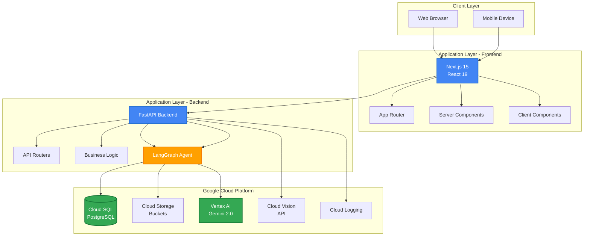

---

## Data Flow - AI Chat

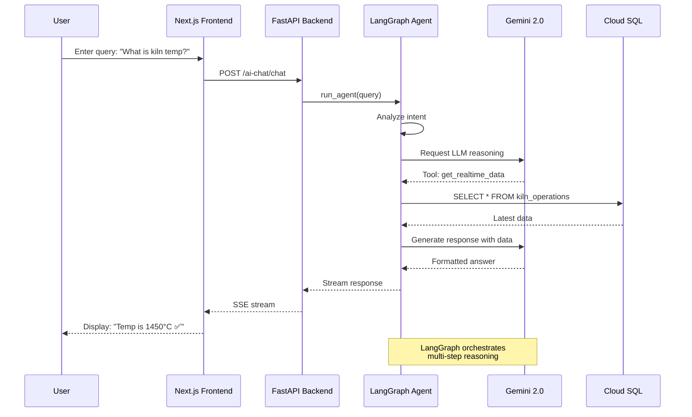

---

## AI Agent State Machine

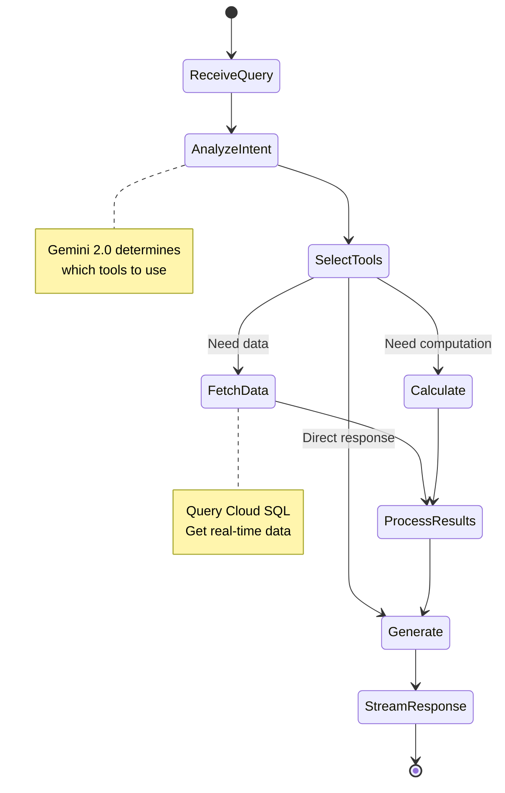

---

## Database Schema

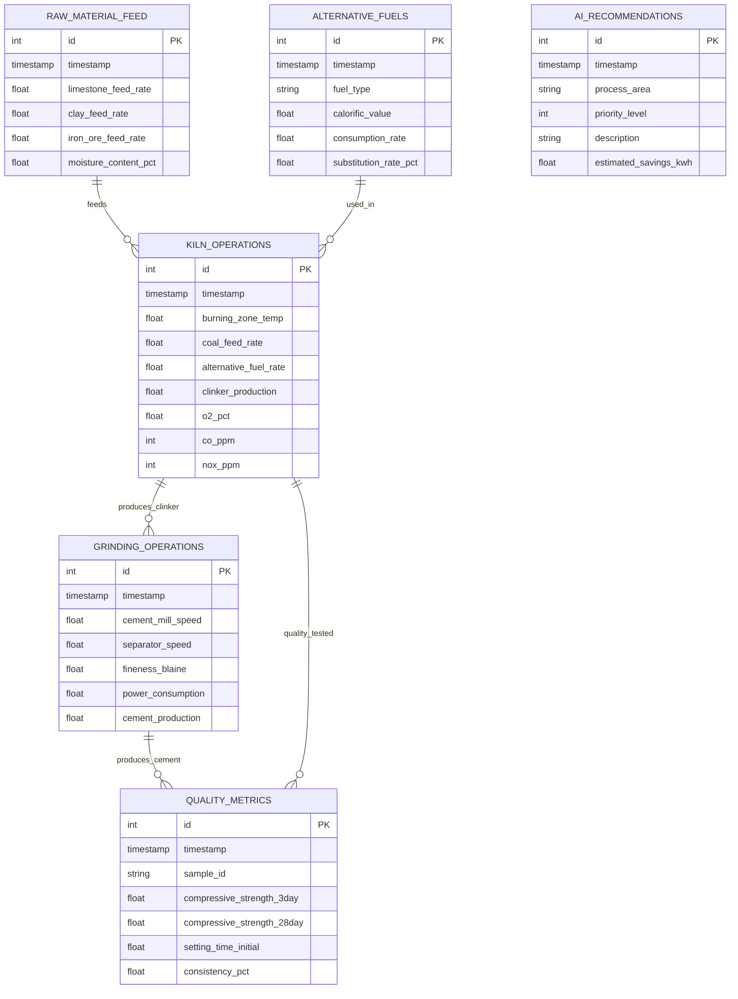

---

## Component Hierarchy - Frontend

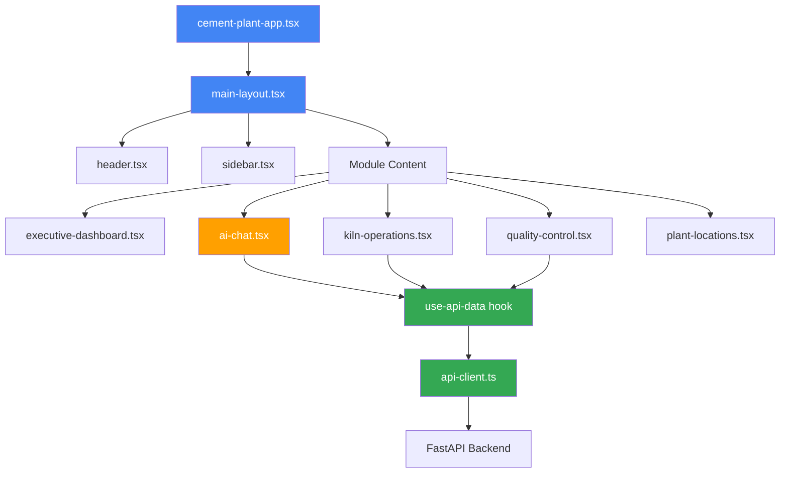

---

## Deployment Architecture - Cloud Run

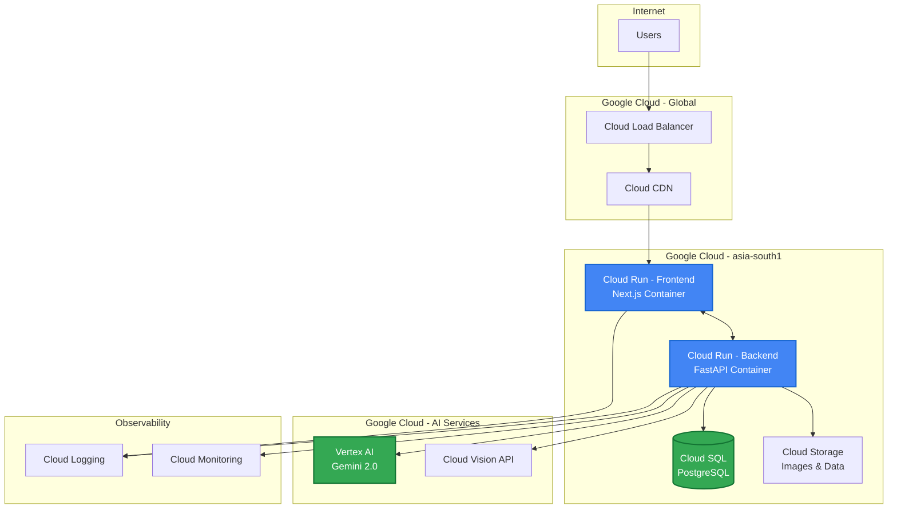

---

## Process Monitoring Flow

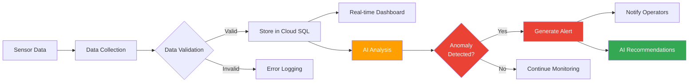

---

## API Request Flow

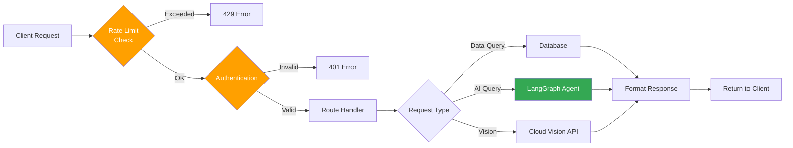

---

## Class Diagram - Backend Core

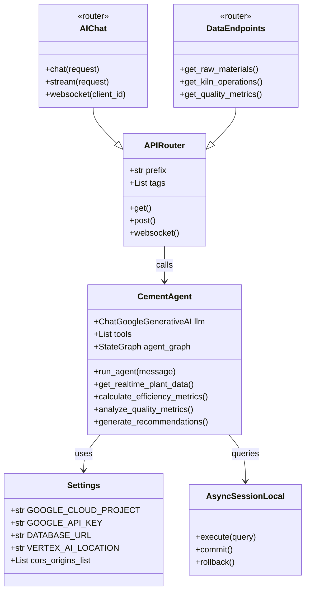

---

## Technology Stack Layers

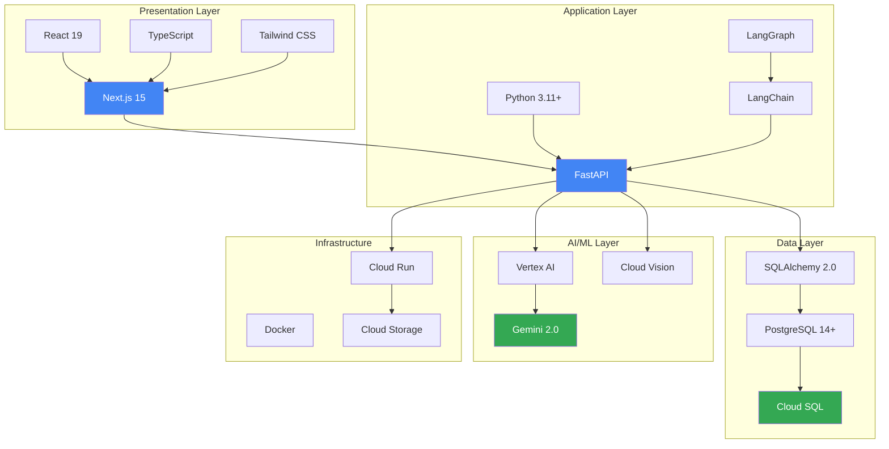

---

## Development Workflow

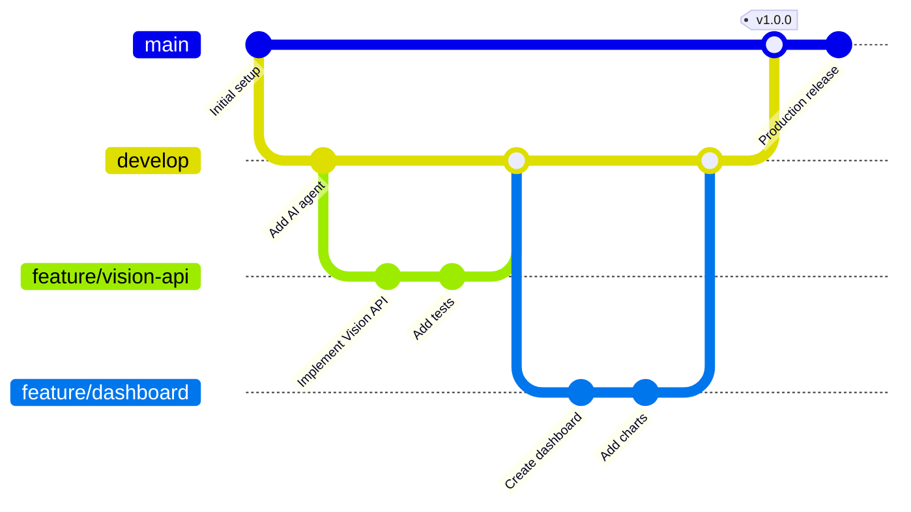

---

**Developed by**: Codygon Technologies Private Limited  
**Support**: support@codygon.com

© 2025 Codygon Technologies Private Limited. All rights reserved.
