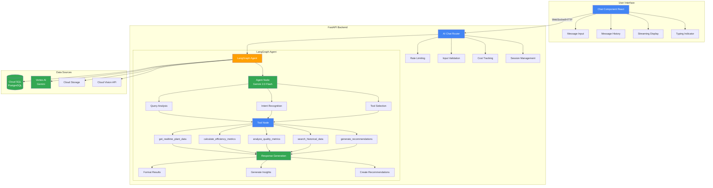

# AI Chat System

Comprehensive guide to the AI-powered conversational interface powered by Google Gemini 2.0 and LangGraph.

---

## Overview

The AI Chat System is an intelligent conversational interface that allows users to interact with the cement plant optimization system using natural language. It leverages Google's Gemini 2.0 Flash model through LangGraph for complex reasoning and tool execution.

---

## Architecture



---

## Features

### 1. Natural Language Understanding

The AI agent can understand and respond to:

**Process Queries:**
- "What is the current kiln temperature?"
- "Show me today's clinker production"
- "How efficient is the grinding operation?"

**Analytical Questions:**
- "Analyze the last 24 hours of kiln operations"
- "Compare this week's production to last week"
- "What are the trends in cement quality?"

**Optimization Requests:**
- "Suggest ways to improve fuel efficiency"
- "How can we reduce energy consumption?"
- "Recommend changes to improve quality"

**Troubleshooting:**
- "Why is the clinker production low?"
- "What's causing the temperature spike?"
- "Identify any anomalies in the data"

### 2. Real-time Data Access

The agent has access to live plant data through tools:

```python
@tool
async def get_realtime_plant_data(
    table_name: str,
    hours_back: int = 1,
    limit: int = 50
) -> Dict[str, Any]:
    """Fetch real-time process data from the database."""
    # Queries database and returns structured data
    pass
```

**Supported Tables:**
- `raw_material_feed`
- `kiln_operations`
- `grinding_operations`
- `quality_metrics`
- `alternative_fuels`

### 3. Efficiency Analysis

Calculates key performance indicators:

```python
@tool
async def calculate_efficiency_metrics(
    process_type: str,
    hours_back: int = 24
) -> Dict[str, Any]:
    """Calculate efficiency metrics for plant processes."""
    pass
```

**Metrics Calculated:**
- Fuel efficiency
- Energy consumption per ton
- Production efficiency
- Quality consistency
- Alternative fuel substitution rate

### 4. Quality Analysis

Monitors and analyzes cement quality:

```python
@tool
async def analyze_quality_metrics(
    hours_back: int = 24,
    grade: str = None
) -> Dict[str, Any]:
    """Analyze quality control metrics."""
    pass
```

**Quality Parameters:**
- Compressive strength (3, 7, 28 days)
- Setting time
- Fineness (Blaine)
- Consistency
- Chemical composition

### 5. Intelligent Recommendations

Generates actionable optimization suggestions:

```python
async def generate_recommendations(
    process_area: str = None
) -> List[Dict[str, Any]]:
    """Generate AI-powered recommendations."""
    pass
```

**Recommendation Types:**
- Energy optimization
- Production improvement
- Quality enhancement
- Maintenance scheduling
- Cost reduction

### 6. Streaming Responses

Real-time response generation for better UX:

```python
async def run_agent(
    user_message: str,
    history: List[BaseMessage] = None
) -> AsyncGenerator[str, None]:
    """Run agent and stream responses."""
    async for event in agent_graph.astream(state):
        if "messages" in event:
            yield event["messages"][-1].content
```

---

## Agent Implementation

### LangGraph State Machine

```python
class AgentState(TypedDict):
    """State for the agent graph."""
    messages: Annotated[List[BaseMessage], add_messages]
    context: Dict[str, Any]
```

### System Prompt

```python
SYSTEM_PROMPT = """You are an expert AI assistant for JK Cement India's 
cement plant optimization system. You help operators and engineers monitor 
and optimize plant operations.

Your capabilities:
- Access real-time plant data from multiple sources
- Calculate efficiency metrics and KPIs
- Analyze quality control data
- Identify anomalies and issues
- Provide optimization recommendations
- Search historical trends

Guidelines:
- Be concise and actionable
- Use metric values when available
- Prioritize safety and quality
- Consider Indian cement manufacturing standards
- Provide recommendations based on data

When analyzing data, always:
1. State current values and status
2. Compare to optimal ranges
3. Identify any issues or anomalies
4. Suggest specific improvements
"""
```

### Tool Definition

```python
@tool
async def get_realtime_plant_data(
    table_name: str,
    hours_back: int = 1,
    limit: int = 50
) -> Dict[str, Any]:
    """
    Fetch real-time process data from the cement plant database.
    
    Args:
        table_name: The table to query (raw_material_feed, 
                    kiln_operations, grinding_operations, quality_metrics)
        hours_back: Number of hours of historical data to fetch
        limit: Maximum number of records to return
        
    Returns:
        Dictionary containing the fetched data
    """
    try:
        async with AsyncSessionLocal() as session:
            query = text(f"""
                SELECT * FROM {table_name}
                WHERE timestamp >= NOW() - INTERVAL '{hours_back} hours'
                ORDER BY timestamp DESC
                LIMIT {limit}
            """)
            
            result = await session.execute(query)
            rows = result.fetchall()
            columns = result.keys()
            
            data = [dict(zip(columns, row)) for row in rows]
            
            return {
                "table": table_name,
                "records_count": len(data),
                "data": data,
                "timestamp": datetime.now().isoformat()
            }
    except Exception as e:
        logger.error(f"Error fetching plant data: {e}")
        return {"error": str(e)}
```

### Graph Construction

```python
# Create the graph
workflow = StateGraph(AgentState)

# Add nodes
workflow.add_node("agent", call_model)
workflow.add_node("tools", ToolNode(tools))

# Add edges
workflow.set_entry_point("agent")
workflow.add_conditional_edges(
    "agent",
    should_continue,
    {
        "continue": "tools",
        "end": END
    }
)
workflow.add_edge("tools", "agent")

# Compile graph
agent_graph = workflow.compile()
```

---

## Frontend Integration

### Chat Component

```typescript
// src/components/modules/ai-chat.tsx

export function AIChatModule() {
  const [messages, setMessages] = useState<Message[]>([]);
  const [input, setInput] = useState('');
  const [isLoading, setIsLoading] = useState(false);

  const sendMessage = async () => {
    if (!input.trim()) return;

    const userMessage: Message = {
      role: 'user',
      content: input,
      timestamp: new Date().toISOString(),
    };

    setMessages([...messages, userMessage]);
    setInput('');
    setIsLoading(true);

    try {
      const response = await fetch('http://localhost:8000/ai-chat/chat', {
        method: 'POST',
        headers: { 'Content-Type': 'application/json' },
        body: JSON.stringify({
          message: input,
          history: messages,
        }),
      });

      const data = await response.json();

      const aiMessage: Message = {
        role: 'assistant',
        content: data.message,
        timestamp: data.timestamp,
        recommendations: data.recommendations,
      };

      setMessages([...messages, userMessage, aiMessage]);
    } catch (error) {
      console.error('Error sending message:', error);
    } finally {
      setIsLoading(false);
    }
  };

  return (
    <div className="chat-container">
      <MessageList messages={messages} />
      <MessageInput
        value={input}
        onChange={setInput}
        onSend={sendMessage}
        disabled={isLoading}
      />
    </div>
  );
}
```

### WebSocket Integration

```typescript
// WebSocket connection for real-time chat

const ws = new WebSocket(
  `ws://localhost:8000/ai-chat/ws/${clientId}`
);

ws.onopen = () => {
  console.log('Connected to AI chat');
};

ws.onmessage = (event) => {
  const data = JSON.parse(event.data);
  
  if (data.type === 'response') {
    addMessage({
      role: 'assistant',
      content: data.content,
      timestamp: data.timestamp,
    });
  }
};

ws.onerror = (error) => {
  console.error('WebSocket error:', error);
};

const sendMessage = (message: string) => {
  ws.send(JSON.stringify({
    type: 'message',
    content: message,
  }));
};
```

### Streaming Responses

```typescript
// Stream AI responses using Server-Sent Events

const streamResponse = async (message: string) => {
  const response = await fetch('http://localhost:8000/ai-chat/stream', {
    method: 'POST',
    headers: { 'Content-Type': 'application/json' },
    body: JSON.stringify({ message }),
  });

  const reader = response.body?.getReader();
  const decoder = new TextDecoder();

  let accumulatedText = '';

  while (true) {
    const { done, value } = await reader!.read();
    
    if (done) break;

    const chunk = decoder.decode(value);
    const lines = chunk.split('\n');

    for (const line of lines) {
      if (line.startsWith('data: ')) {
        const data = JSON.parse(line.slice(6));
        
        if (data.type === 'token') {
          accumulatedText += data.content;
          updateStreamingMessage(accumulatedText);
        } else if (data.type === 'complete') {
          finalizeMessage(data.message);
        }
      }
    }
  }
};
```

---

## Example Interactions

### Example 1: Current Status Query

**User:** "What is the current kiln temperature?"

**Agent Response:**
```
The current kiln burning zone temperature is 1,450°C (measured at 10:15 AM).

📊 Status: ✅ Optimal
• Operating range: 1,400-1,500°C
• Current value: Within optimal range
• Trend: Stable over last hour

Other kiln parameters:
• Preheater temp: 850°C
• Cooler temp: 120°C
• Kiln speed: 3.5 RPM
• Coal feed rate: 25.5 TPH

💡 Recommendation: Maintain current temperature settings.
```

### Example 2: Efficiency Analysis

**User:** "Analyze the efficiency of our kiln operations over the last 24 hours"

**Agent Response:**
```
📈 Kiln Operations Analysis (Last 24 Hours)

Overall Efficiency Score: 87.5/100 ⭐

Key Metrics:
• Average clinker production: 158.5 TPH
• Fuel efficiency: 92.3%
• Alternative fuel substitution: 24.8%
• Specific energy consumption: 3.2 GJ/ton clinker

Performance Breakdown:
✅ Temperature control: Excellent (95%)
✅ Production rate: Above target
⚠️  Fuel consumption: Slightly high

Identified Issues:
1. Coal feed rate averaging 5% above optimal
2. Minor temperature fluctuations in preheater

💡 Recommendations:
1. Reduce coal feed rate by 3-5% to improve fuel efficiency
2. Optimize preheater airflow to stabilize temperature
3. Potential energy savings: 150 kWh/hour
4. Estimated cost savings: ₹15,000/day
```

### Example 3: Quality Inquiry

**User:** "How is the cement quality today?"

**Agent Response:**
```
🎯 Cement Quality Status - Today

Overall Quality Score: 95.2/100 ✅

Latest Test Results (Sample QC-2025-1103-001):
• Compressive Strength:
  - 3-day: 18.5 MPa (Target: >16 MPa) ✅
  - 7-day: 28.2 MPa (Target: >22 MPa) ✅
  - 28-day: 45.8 MPa (Target: >43 MPa) ✅

• Setting Time:
  - Initial: 125 min (Spec: 30-600 min) ✅
  - Final: 185 min ✅

• Fineness: 3,500 cm²/g (Target: 3,200-3,800) ✅
• Consistency: 28% (Target: 25-30%) ✅

Trend: Quality parameters stable over last 7 days

✨ All parameters meet IS 269:2015 standards for OPC 43 Grade
```

### Example 4: Troubleshooting

**User:** "Why is clinker production lower than normal?"

**Agent Response:**
```
🔍 Clinker Production Analysis

Current Production: 145.2 TPH
Normal Production: 160-165 TPH
Shortfall: -9.5% ❗

Root Cause Analysis:
I've identified 3 contributing factors:

1. ⚠️  Reduced Feed Rate (Primary)
   • Raw material feed: 172 TPH (normal: 185 TPH)
   • Impact: -7% production
   • Possible cause: Feeder adjustment or material flow issue

2. ⚠️  Lower Kiln Speed
   • Current: 3.2 RPM (optimal: 3.5 RPM)
   • Impact: -3% production
   • May be intentional for temperature control

3. ℹ️  Coal Feed Rate
   • Slightly elevated, compensating for lower speed
   • Not a primary factor

💡 Recommended Actions:
1. Check raw material feeder for blockages or mechanical issues
2. Verify material moisture content (high moisture reduces flow)
3. If feed issue resolved, gradually increase kiln speed to 3.5 RPM
4. Monitor burning zone temperature during adjustments

Expected Result: Production should return to 160+ TPH within 2 hours

Would you like me to generate a detailed maintenance checklist?
```

---

## Rate Limiting & Cost Management

### Rate Limiting

```python
# Per IP address
RATE_LIMIT_REQUESTS = 100  # requests per minute
RATE_LIMIT_WINDOW = 60  # seconds

# Per client
TOKEN_LIMIT_PER_DAY = 10000  # AI tokens
COST_LIMIT_PER_DAY = 5.00  # USD
```

### Cost Tracking

```python
def track_cost(client_id: str, tokens: int, cost: float):
    """Track AI API usage and costs."""
    usage_data[client_id]["tokens"] += tokens
    usage_data[client_id]["cost"] += cost
    usage_data[client_id]["requests"] += 1
```

### Token Estimation

```python
def estimate_tokens(text: str) -> int:
    """Estimate token count for text."""
    # Rough estimate: 4 characters per token
    return len(text) // 4
```

---

## Best Practices

### For Users

1. **Be Specific**: Ask clear, specific questions
2. **Provide Context**: Mention time ranges when relevant
3. **Follow Up**: Ask for clarification if needed
4. **Use Examples**: Reference specific parameters or values

### For Developers

1. **Validate Input**: Always sanitize user input
2. **Handle Errors**: Gracefully handle API failures
3. **Monitor Costs**: Track token usage and costs
4. **Optimize Prompts**: Keep system prompts concise
5. **Cache Results**: Cache frequent queries when possible
6. **Log Interactions**: Log for debugging and improvement

---

## Troubleshooting

### Issue: Slow Responses

**Solutions:**
- Reduce `hours_back` parameter in tools
- Limit result set sizes
- Use caching for frequent queries
- Consider database indexes

### Issue: Inaccurate Responses

**Solutions:**
- Improve system prompt with more context
- Add validation to tool outputs
- Provide more examples in prompt
- Update tool descriptions

### Issue: Rate Limit Errors

**Solutions:**
- Implement exponential backoff
- Increase rate limits if justified
- Queue requests during high load
- Use caching to reduce API calls

---

## Future Enhancements

1. **Multi-language Support**: Support for Hindi and regional languages
2. **Voice Interface**: Voice input/output capabilities
3. **Context Awareness**: Better conversation memory
4. **Predictive Insights**: Proactive recommendations
5. **Integration**: Connect with MES, ERP systems
6. **Custom Agents**: Specialized agents for different roles

---

## Next Steps

- **[Vision API Integration](./vision-api.md)** - Quality inspection system
- **[Real-time Monitoring](./monitoring.md)** - Live dashboards
- **[Analytics Engine](./analytics.md)** - Data analysis tools
- **[API Reference](../backend/api-reference.md)** - Complete API docs

---

**Last Updated**: November 2025
