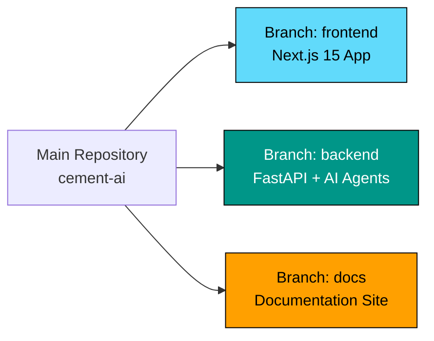
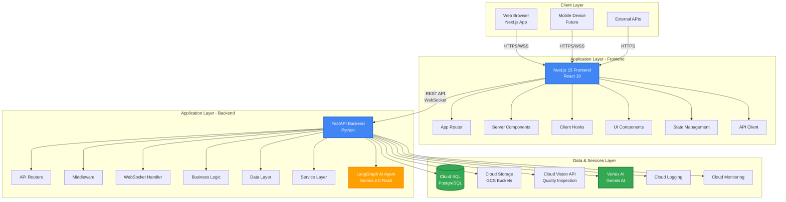
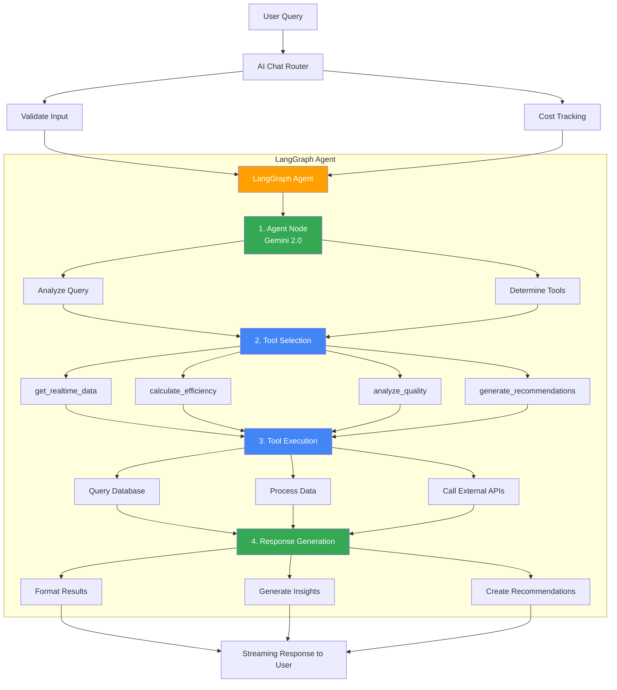

# System Architecture

Comprehensive overview of the JK Cement AI Optimization System architecture.

---

## Repository Structure

The project follows a **multi-branch architecture** for better separation of concerns:



### Branch Organization

| Branch | Purpose | Technology Stack | Entry Point |
|--------|---------|------------------|-------------|
| **`frontend`** | User interface and client-side logic | Next.js 15, React 19, TypeScript, Tailwind CSS | `src/app/page.tsx` |
| **`backend`** | API server, AI agents, business logic | Python 3.11+, FastAPI, LangGraph, PostgreSQL | `app/main.py` |
| **`docs`** | Documentation website | Docsify, Markdown, Mermaid | `index.html` |

> **Why separate branches?** This structure allows independent deployment, versioning, and development workflows for each component while maintaining a single repository for project coordination.

---

## High-Level Architecture



---

## Component Architecture

### Frontend Architecture (Next.js 15)

```
src/
├── app/                      # Next.js App Router
│   ├── layout.tsx           # Root layout with providers
│   ├── page.tsx             # Home page
│   └── globals.css          # Global styles
│
├── components/              # React components
│   ├── cement-plant-app.tsx # Main application component
│   │
│   ├── layout/              # Layout components
│   │   ├── main-layout.tsx  # Primary layout structure
│   │   ├── header.tsx       # App header with navigation
│   │   └── sidebar.tsx      # Module navigation sidebar
│   │
│   ├── modules/             # Feature modules
│   │   ├── ai-chat.tsx             # AI chatbot interface
│   │   ├── executive-dashboard.tsx # KPI dashboard
│   │   ├── kiln-operations.tsx     # Kiln monitoring
│   │   ├── raw-materials.tsx       # Material management
│   │   ├── grinding-operations.tsx # Grinding monitoring
│   │   ├── quality-control.tsx     # Quality metrics
│   │   ├── fuel-optimization.tsx   # Fuel management
│   │   ├── utilities.tsx           # Utilities monitoring
│   │   ├── cross-process.tsx       # Cross-process analysis
│   │   ├── plant-locations.tsx     # Plant map
│   │   └── ai-insights.tsx         # AI recommendations
│   │
│   └── ui/                  # Reusable UI components
│       ├── button.tsx       # Button component
│       ├── card.tsx         # Card component
│       ├── input.tsx        # Input component
│       ├── select.tsx       # Select component
│       ├── dialog.tsx       # Modal dialog
│       ├── progress.tsx     # Progress bar
│       ├── badge.tsx        # Badge component
│       ├── kpi-card.tsx     # KPI display card
│       ├── page-header.tsx  # Page header
│       └── loading-spinner.tsx # Loading indicator
│
├── hooks/                   # Custom React hooks
│   ├── use-active-module.ts # Module state management
│   └── use-api-data.ts      # Data fetching hook
│
├── lib/                     # Utility libraries
│   ├── api-client.ts        # API client functions
│   └── utils.ts             # Utility functions
│
├── types/                   # TypeScript definitions
│   ├── database.types.ts    # Database type definitions
│   └── plant-data.ts        # Plant data types
│
└── constants/               # Application constants
    └── index.ts             # Constant definitions
```

### Backend Architecture (FastAPI)

```
backend/
├── app/
│   ├── main.py              # Application entry point
│   │
│   ├── core/                # Core functionality
│   │   ├── config.py        # Configuration management
│   │   ├── database.py      # Database setup
│   │   ├── logging_config.py # Logging configuration
│   │   └── simple_protection.py # Rate limiting & security
│   │
│   ├── db/                  # Database layer
│   │   └── session.py       # Database session management
│   │
│   ├── agents/              # AI agents
│   │   └── cement_agent.py  # LangGraph AI agent
│   │
│   └── routers/             # API endpoints
│       ├── ai_chat.py       # AI chat endpoints
│       ├── analytics.py     # Analytics endpoints
│       ├── data_endpoints.py # Data CRUD operations
│       ├── data.py          # Legacy data endpoints
│       ├── locations.py     # Plant locations API
│       └── vision.py        # Vision API integration
│
├── scripts/                 # Utility scripts
│   ├── populate_database.py # Database seeding
│   ├── create_missing_tables.py # Schema setup
│   └── check_schema.py      # Schema validation
│
├── requirements.txt         # Python dependencies
├── Dockerfile              # Container configuration
└── main.py                 # Alternate entry point
```

---

## Data Flow Architecture

### Request Flow

```mermaid
sequenceDiagram
    participant B as Browser
    participant N as Next.js Page
    participant A as API Client
    participant F as FastAPI Router
    participant S as Service Layer
    participant D as Database/Cloud
    participant U as Frontend UI
    
    B->>N: 1. User Action
    N->>A: 2. API Request
    A->>F: 3. HTTP/WebSocket
    F->>F: Validate Request<br/>Rate Limit Check<br/>Authentication
    F->>S: 4. Business Logic
    S->>S: Data Processing<br/>AI Agent (if needed)
    S->>D: 5. Data Query
    Note over D: Cloud SQL<br/>Cloud Storage<br/>Vertex AI
    D-->>S: 6. Response Data
    S-->>F: Transform Data
    F-->>A: 7. JSON Response
    A-->>U: Update State
    U-->>B: Render View
    
    style F fill:#4285F4,color:#fff
    style S fill:#4285F4,color:#fff
    style D fill:#34A853,color:#fff
```

### AI Agent Flow (LangGraph)



---

## Database Architecture

### Entity Relationship Diagram

```
┌─────────────────────┐
│ raw_material_feed   │
│─────────────────────│
│ id (PK)            │
│ timestamp          │
│ limestone_feed_rate │
│ clay_feed_rate     │
│ iron_ore_feed_rate │
│ ...                │
└─────────────────────┘

┌─────────────────────┐
│ kiln_operations     │
│─────────────────────│
│ id (PK)            │
│ timestamp          │
│ burning_zone_temp  │
│ coal_feed_rate     │
│ clinker_production │
│ ...                │
└─────────────────────┘

┌─────────────────────┐
│ grinding_operations │
│─────────────────────│
│ id (PK)            │
│ timestamp          │
│ cement_mill_speed  │
│ separator_speed    │
│ fineness_blaine    │
│ ...                │
└─────────────────────┘

┌─────────────────────┐
│ quality_metrics     │
│─────────────────────│
│ id (PK)            │
│ timestamp          │
│ compressive_strength│
│ setting_time       │
│ consistency        │
│ ...                │
└─────────────────────┘

┌─────────────────────┐
│ alternative_fuels   │
│─────────────────────│
│ id (PK)            │
│ timestamp          │
│ fuel_type          │
│ calorific_value    │
│ consumption_rate   │
│ ...                │
└─────────────────────┘

┌─────────────────────┐
│ ai_recommendations  │
│─────────────────────│
│ id (PK)            │
│ timestamp          │
│ process_area       │
│ priority_level     │
│ description        │
│ estimated_savings  │
│ ...                │
└─────────────────────┘

┌─────────────────────┐
│ plant_locations     │
│─────────────────────│
│ id (PK)            │
│ plant_name         │
│ latitude           │
│ longitude          │
│ state              │
│ capacity_mtpa      │
│ ...                │
└─────────────────────┘
```

---

## Google Cloud Architecture

### Service Integration

```
┌────────────────────────────────────────────────────────────┐
│                    Application                              │
│                 (Backend + Frontend)                        │
└──────┬─────────────┬─────────────┬──────────────┬──────────┘
       │             │             │              │
       │             │             │              │
   ┌───▼────┐   ┌────▼─────┐  ┌───▼──────┐  ┌────▼────────┐
   │Vertex  │   │  Cloud   │  │  Cloud   │  │   Cloud     │
   │  AI    │   │   SQL    │  │ Storage  │  │   Vision    │
   │(Gemini)│   │(Postgres)│  │ (Buckets)│  │     API     │
   └────────┘   └──────────┘  └──────────┘  └─────────────┘
       │             │             │              │
       └─────────────┴─────────────┴──────────────┘
                     │
              ┌──────▼───────┐
              │    Cloud     │
              │   Logging    │
              │              │
              └──────────────┘
```

### Deployment Options

#### Option 1: Cloud Run (Serverless)
```
Internet
   │
   ▼
Cloud Load Balancer
   │
   ├──▼ Cloud Run (Frontend)
   │    - Next.js SSR
   │    - Auto-scaling
   │
   └──▼ Cloud Run (Backend)
        - FastAPI
        - Auto-scaling
```

#### Option 2: Compute Engine (VMs)
```
Internet
   │
   ▼
Cloud Load Balancer
   │
   ▼
Managed Instance Group
   │
   ├──▼ VM Instance 1
   │    - Nginx + Next.js
   │    - Gunicorn + FastAPI
   │
   └──▼ VM Instance 2 (Auto-scaled)
        - Nginx + Next.js
        - Gunicorn + FastAPI
```

---

## Security Architecture

### Authentication & Authorization

```
┌──────────────┐
│   Client     │
└──────┬───────┘
       │ 1. Request with Token
       ▼
┌──────────────────────┐
│  API Gateway/Nginx   │
│  - SSL/TLS           │
│  - CORS              │
└──────┬───────────────┘
       │ 2. Forward Request
       ▼
┌──────────────────────┐
│  FastAPI Middleware  │
│  - Validate Token    │
│  - Check Rate Limit  │
│  - Log Request       │
└──────┬───────────────┘
       │ 3. Authorized Request
       ▼
┌──────────────────────┐
│  Router Handler      │
│  - Process Request   │
│  - Return Response   │
└──────────────────────┘
```

### Rate Limiting

```python
# Simple in-memory rate limiting
Rate Limit Store (In-Memory)
├── Client IP → Request Count & Window
├── Client ID → Token Count & Cost
└── Endpoint → Global Rate Limit

Limits:
- 100 requests/minute per IP
- 10,000 tokens/day per client
- Custom limits per endpoint
```

---

## Monitoring & Observability

### Logging Architecture

```
Application Logs
    │
    ▼
┌─────────────────────┐
│  Logging Config     │
│  - Structured JSON  │
│  - Log Levels       │
│  - Context          │
└─────────┬───────────┘
          │
    ┌─────┴─────┐
    │           │
    ▼           ▼
┌────────┐  ┌──────────────┐
│ stdout │  │ Cloud Logging│
│ stderr │  │ (Optional)   │
└────────┘  └──────────────┘
```

### Metrics Collection

```
Application Metrics
├── Request Metrics
│   ├── Request Count
│   ├── Response Time
│   ├── Error Rate
│   └── Status Codes
│
├── AI Agent Metrics
│   ├── Token Usage
│   ├── Request Cost
│   ├── Tool Invocations
│   └── Response Time
│
└── System Metrics
    ├── CPU Usage
    ├── Memory Usage
    ├── Database Connections
    └── Active WebSockets
```

---

## Scalability Considerations

### Horizontal Scaling

```
Load Balancer
    │
    ├──▼ Backend Instance 1
    ├──▼ Backend Instance 2
    ├──▼ Backend Instance 3
    └──▼ Backend Instance N
         │
         ▼
    Shared Database
    (Cloud SQL with Read Replicas)
```

### Caching Strategy

```
Request
    │
    ▼
┌─────────────┐
│  API Layer  │
└──────┬──────┘
       │
       ▼ Check Cache
┌─────────────┐
│ Redis Cache │ ◄──── Cache Hit (Return)
└──────┬──────┘
       │ Cache Miss
       ▼
┌─────────────┐
│  Database   │
└──────┬──────┘
       │
       └──▼ Store in Cache
```

---

## Technology Decisions

### Frontend: Why Next.js 15?

- **App Router**: Modern routing with server components
- **React 19**: Latest features and performance
- **SSR/SSG**: Better SEO and initial load
- **TypeScript**: Type safety and developer experience
- **Turbopack**: Fast development builds

### Backend: Why FastAPI?

- **Performance**: Async/await support
- **Modern Python**: Type hints and validation
- **Auto Documentation**: Swagger UI included
- **WebSocket Support**: Real-time communication
- **Easy Integration**: With Google Cloud services

### AI: Why LangGraph?

- **Stateful Agents**: Complex multi-step reasoning
- **Tool Integration**: Easy tool creation and use
- **Streaming**: Real-time response streaming
- **Debugging**: Built-in visualization
- **Flexibility**: Customizable agent behavior

### Database: Why PostgreSQL?

- **ACID Compliance**: Data integrity
- **JSON Support**: Flexible data structures
- **Time Series**: Efficient temporal queries
- **Scalability**: Vertical and horizontal scaling
- **Cloud SQL**: Managed service integration

---

## Cost Considerations

Running this architecture on Google Cloud Platform:

- **Development/Testing**: ~$20/month
- **Production (Low Traffic)**: ~$100/month
- **Production (Medium Traffic)**: ~$250-400/month
- **Production (High Traffic with HA)**: ~$850-1,000/month
- **Enterprise (Multi-Region)**: ~$2,200-2,500/month

**Key Cost Drivers**:
1. Vertex AI / Gemini API usage (pay-per-token)
2. Cloud SQL instance size and storage
3. Cloud Run compute time or Compute Engine VMs
4. Network egress and Cloud Storage
5. Cloud Vision API calls

**ROI**: For a typical cement plant, the system delivers **190-380x ROI** through energy optimization, quality improvement, and predictive maintenance.

See **[Complete Cost Analysis](../deployment/cost-analysis.md)** for detailed breakdown and optimization strategies.

---

## Next Steps

- **[Data Flow Documentation](./data-flow.md)** - Detailed data flow patterns
- **[AI Agent System](./ai-agent.md)** - LangGraph implementation details
- **[Database Schema](./database-schema.md)** - Complete schema reference
- **[Backend Overview](../backend/overview.md)** - Backend implementation guide
- **[Frontend Overview](../frontend/overview.md)** - Frontend implementation guide

---

**Last Updated**: November 2025  
**Developed by**: Codygon Technologies Private Limited  
**Support**: support@codygon.com

© 2025 Codygon Technologies Private Limited. All rights reserved.
