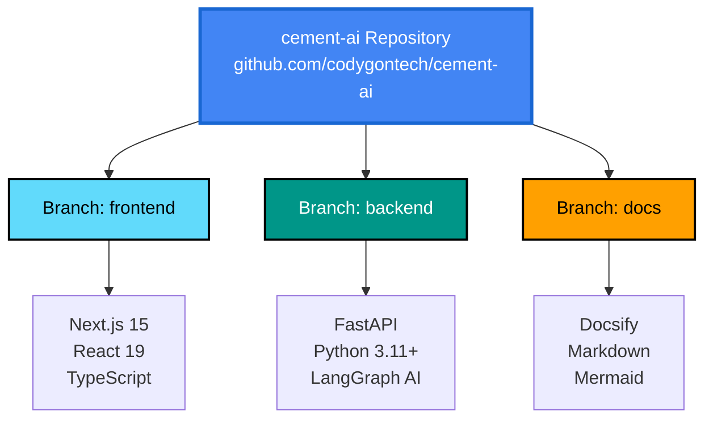

# Repository Structure

Understanding the multi-branch architecture of the JK Cement AI project.

---

## Overview

The JK Cement AI Optimization System uses a **multi-branch repository structure** where each major component lives in its own Git branch. This approach provides clear separation between frontend, backend, and documentation codebases.



---

## Branch Details

### `frontend` Branch

**Purpose**: User interface and client-side application

**Technology Stack**:
- Next.js 15 with App Router
- React 19
- TypeScript
- Tailwind CSS
- Shadcn UI components

**Structure**:
```
cement-ai/ (frontend branch)
├── src/
│   ├── app/              # Next.js App Router
│   ├── components/       # React components
│   │   ├── layout/      # Layout components
│   │   ├── modules/     # Feature modules
│   │   └── ui/          # UI components (shadcn)
│   ├── hooks/           # Custom React hooks
│   ├── lib/             # Utility functions
│   ├── types/           # TypeScript type definitions
│   └── constants/       # Application constants
├── public/              # Static assets
├── package.json         # Dependencies
├── tsconfig.json        # TypeScript config
├── tailwind.config.ts   # Tailwind config
├── next.config.mjs      # Next.js config
└── Dockerfile           # Container definition
```

**Key Features**:
- Server-side rendering (SSR)
- Real-time WebSocket connections
- Modular architecture (Plant Overview, Kiln, Raw Mill, etc.)
- AI Chat interface
- Interactive dashboards

**Development**:
```bash
git clone https://github.com/codygontech/cement-ai.git
cd cement-ai
git checkout frontend
npm install
npm run dev
```

---

### `backend` Branch

**Purpose**: API server, business logic, and AI agents

**Technology Stack**:
- FastAPI (Python web framework)
- Python 3.11+
- LangGraph (AI agent framework)
- Google Gemini 2.0 Flash
- PostgreSQL with asyncpg
- Cloud Vision API

**Structure**:
```
cement-ai/ (backend branch)
├── app/
│   ├── main.py          # FastAPI application entry
│   ├── agents/          # LangGraph AI agents
│   │   ├── cement_optimizer.py
│   │   └── tools/       # AI agent tools
│   ├── core/            # Core configuration
│   │   ├── config.py    # Settings
│   │   └── database.py  # Database setup
│   ├── db/              # Database layer
│   │   ├── models.py    # SQLAlchemy models
│   │   └── session.py   # DB sessions
│   └── routers/         # API endpoints
│       ├── ai.py        # AI chat endpoints
│       ├── plants.py    # Plant data endpoints
│       ├── vision.py    # Vision API endpoints
│       └── websocket.py # WebSocket handlers
├── scripts/             # Utility scripts
│   └── populate_database.py
├── requirements.txt     # Python dependencies
├── .env.example         # Environment template
└── Dockerfile           # Container definition
```

**Key Features**:
- RESTful API endpoints
- WebSocket real-time communication
- AI agent with LangGraph + Gemini
- PostgreSQL database integration
- Google Cloud services integration
- Async/await architecture

**Development**:
```bash
git clone https://github.com/codygontech/cement-ai.git
cd cement-ai
git checkout backend
python -m venv venv
source venv/bin/activate  # Windows: venv\Scripts\activate
pip install -r requirements.txt
uvicorn app.main:app --reload
```

---

### `docs` Branch

**Purpose**: Project documentation website

**Technology Stack**:
- Docsify (Markdown-based documentation)
- Mermaid (Diagrams)
- GitHub Pages / Netlify (Hosting)

**Structure**:
```
cement-ai/ (docs branch)
├── index.html           # Docsify entry point
├── _sidebar.md          # Sidebar navigation
├── _navbar.md           # Top navigation bar
├── INDEX.md             # Documentation home
├── getting-started/     # Getting started guides
│   ├── quick-start.md
│   ├── architecture.md
│   └── repository-structure.md
├── backend/             # Backend documentation
│   └── api-reference.md
├── deployment/          # Deployment guides
│   ├── overview.md
│   └── cost-analysis.md
├── development/         # Developer guides
│   └── setup.md
├── features/            # Feature documentation
│   └── ai-chat.md
├── reference/           # Reference materials
│   └── environment-variables.md
└── user-guide/          # User guides
    └── user-journey.md
```

**Key Features**:
- Live Markdown rendering
- Mermaid diagram support
- Full-text search
- Mobile responsive
- Dark mode support

**Development**:
```bash
git clone https://github.com/codygontech/cement-ai.git
cd cement-ai
git checkout docs
npx docsify serve .
# Visit: http://localhost:3000
```

---

## Why Multi-Branch Architecture?

### Advantages

✅ **Independent Deployment**
- Each component can be deployed separately
- Frontend updates don't require backend redeployment
- Documentation updates are instant

✅ **Clear Separation of Concerns**
- Frontend developers work on `frontend` branch
- Backend developers work on `backend` branch
- Technical writers work on `docs` branch
- No merge conflicts between different codebases

✅ **Independent Versioning**
- Each component can have its own version tags
- Frontend v2.0 can work with Backend v1.5
- Semantic versioning per component

✅ **Focused CI/CD Pipelines**
- Separate build pipelines for each branch
- Frontend tests don't run on backend changes
- Faster build and deployment times

✅ **Different Technology Stacks**
- Frontend: Node.js ecosystem
- Backend: Python ecosystem
- Docs: Static site generation
- No dependency conflicts

✅ **Easier Collaboration**
- New contributors can clone only what they need
- Smaller repository size per branch
- Faster clone times

### Considerations

⚠️ **Coordination Required**
- API changes need coordination between frontend/backend
- Version compatibility must be maintained
- Integration testing requires both branches

⚠️ **Multiple Clones Needed**
- Developers may need 2-3 working directories
- Git worktrees can help manage this

---

## Working with Multiple Branches

### Method 1: Separate Directories (Recommended)

Clone the repository multiple times for different branches:

```bash
# Create a workspace folder
mkdir cement-ai-workspace
cd cement-ai-workspace

# Clone frontend
git clone -b frontend https://github.com/codygontech/cement-ai.git frontend

# Clone backend
git clone -b backend https://github.com/codygontech/cement-ai.git backend

# Clone docs
git clone -b docs https://github.com/codygontech/cement-ai.git docs

# Result:
# cement-ai-workspace/
# ├── frontend/
# ├── backend/
# └── docs/
```

### Method 2: Git Worktrees

Use Git worktrees to manage multiple branches efficiently:

```bash
# Clone the main repository
git clone https://github.com/codygontech/cement-ai.git
cd cement-ai

# Create worktrees for each branch
git worktree add ../cement-ai-frontend frontend
git worktree add ../cement-ai-backend backend
git worktree add ../cement-ai-docs docs

# Result:
# cement-ai/         (main/empty)
# cement-ai-frontend/ (frontend branch)
# cement-ai-backend/  (backend branch)
# cement-ai-docs/     (docs branch)
```

### Method 3: Switch Between Branches

For documentation-only work or when working on one component at a time:

```bash
git clone https://github.com/codygontech/cement-ai.git
cd cement-ai

# Work on frontend
git checkout frontend
npm install
npm run dev

# Switch to backend
git checkout backend
pip install -r requirements.txt
uvicorn app.main:app --reload

# Switch to docs
git checkout docs
docsify serve .
```

---

## Branch Synchronization

### Keep Branches Updated

```bash
# Update frontend branch
cd cement-ai-frontend
git checkout frontend
git pull origin frontend

# Update backend branch
cd ../cement-ai-backend
git checkout backend
git pull origin backend

# Update docs branch
cd ../cement-ai-docs
git checkout docs
git pull origin docs
```

### Creating Feature Branches

Always create feature branches from the appropriate base branch:

```bash
# Frontend feature
cd cement-ai-frontend
git checkout frontend
git pull origin frontend
git checkout -b feature/new-dashboard
# Make changes, commit, push

# Backend feature
cd ../cement-ai-backend
git checkout backend
git pull origin backend
git checkout -b feature/new-endpoint
# Make changes, commit, push
```

---

## CI/CD Integration

Each branch should have its own CI/CD pipeline:

### GitHub Actions Example

**Frontend** (`.github/workflows/frontend.yml` on `frontend` branch):
```yaml
name: Frontend CI/CD
on:
  push:
    branches: [frontend]
jobs:
  build:
    runs-on: ubuntu-latest
    steps:
      - uses: actions/checkout@v3
      - uses: actions/setup-node@v3
      - run: npm ci
      - run: npm run build
      - run: npm test
```

**Backend** (`.github/workflows/backend.yml` on `backend` branch):
```yaml
name: Backend CI/CD
on:
  push:
    branches: [backend]
jobs:
  test:
    runs-on: ubuntu-latest
    steps:
      - uses: actions/checkout@v3
      - uses: actions/setup-python@v4
      - run: pip install -r requirements.txt
      - run: pytest
```

**Docs** (`.github/workflows/docs.yml` on `docs` branch):
```yaml
name: Deploy Docs
on:
  push:
    branches: [docs]
jobs:
  deploy:
    runs-on: ubuntu-latest
    steps:
      - uses: actions/checkout@v3
      - uses: peaceiris/actions-gh-pages@v3
```

---

## Version Management

### Tagging Releases

Tag releases on each branch independently:

```bash
# Frontend release
cd cement-ai-frontend
git tag -a frontend-v1.2.0 -m "Frontend v1.2.0 release"
git push origin frontend-v1.2.0

# Backend release
cd ../cement-ai-backend
git tag -a backend-v1.1.0 -m "Backend v1.1.0 release"
git push origin backend-v1.1.0

# Documentation update
cd ../cement-ai-docs
git tag -a docs-v1.0.5 -m "Documentation update"
git push origin docs-v1.0.5
```

### Version Compatibility Matrix

| Frontend Version | Backend Version | Status |
|-----------------|-----------------|--------|
| v1.2.x | v1.1.x | ✅ Compatible |
| v1.1.x | v1.1.x | ✅ Compatible |
| v1.2.x | v1.0.x | ⚠️ Limited |

---

## FAQ

### Q: Why not use a monorepo?

**A**: While monorepos have benefits, the multi-branch approach was chosen for:
- Clear separation of concerns
- Independent deployment cycles
- Smaller repository sizes per branch
- Different technology stacks don't interfere

### Q: How do I work on both frontend and backend simultaneously?

**A**: Use separate directories (Method 1) or Git worktrees (Method 2) to have both branches checked out at the same time.

### Q: What if I need code shared between frontend and backend?

**A**: Shared code should be minimal due to different languages (TypeScript vs Python). API contracts are the interface. Consider:
- Shared type definitions via OpenAPI/Swagger
- Generated TypeScript types from Python models
- Separate shared utilities package if needed

### Q: How do I contribute?

**A**: 
1. Fork the repository
2. Checkout the appropriate branch (`frontend`, `backend`, or `docs`)
3. Create a feature branch
4. Make changes
5. Submit a pull request to the original branch

### Q: Can I see the commit history across all branches?

**A**: Yes, use:
```bash
git log --all --graph --decorate --oneline
```

---

## Next Steps

- [Quick Start Guide](./quick-start.md) - Get the system running
- [Development Setup](../development/setup.md) - Set up your dev environment
- [Architecture Overview](./architecture.md) - Understand the system design
- [Deployment Guide](../deployment/overview.md) - Deploy to production

---

**Questions?** Open an issue on [GitHub](https://github.com/codygontech/cement-ai/issues)
