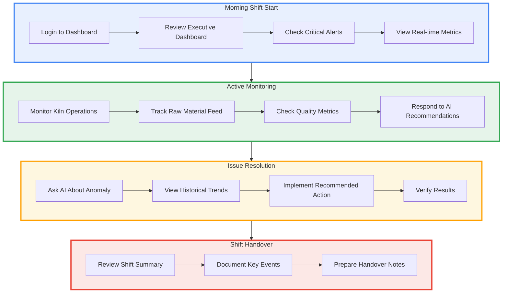
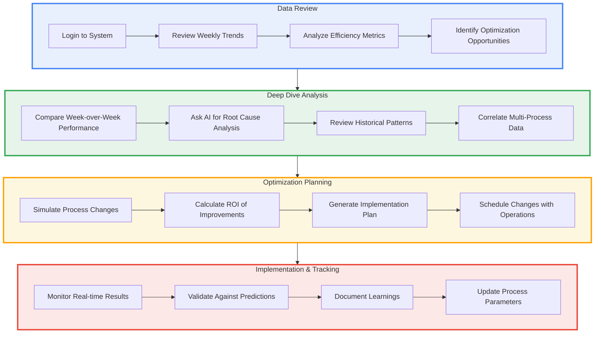
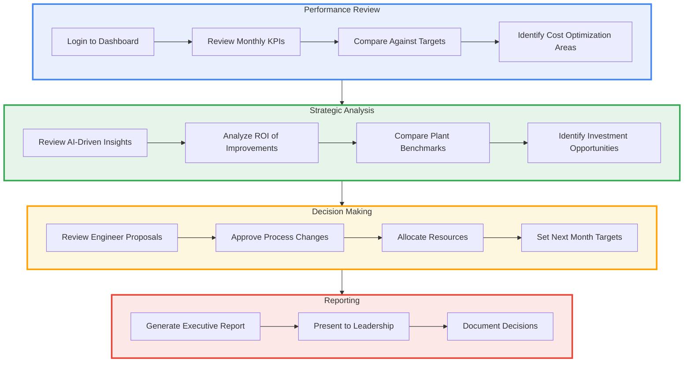
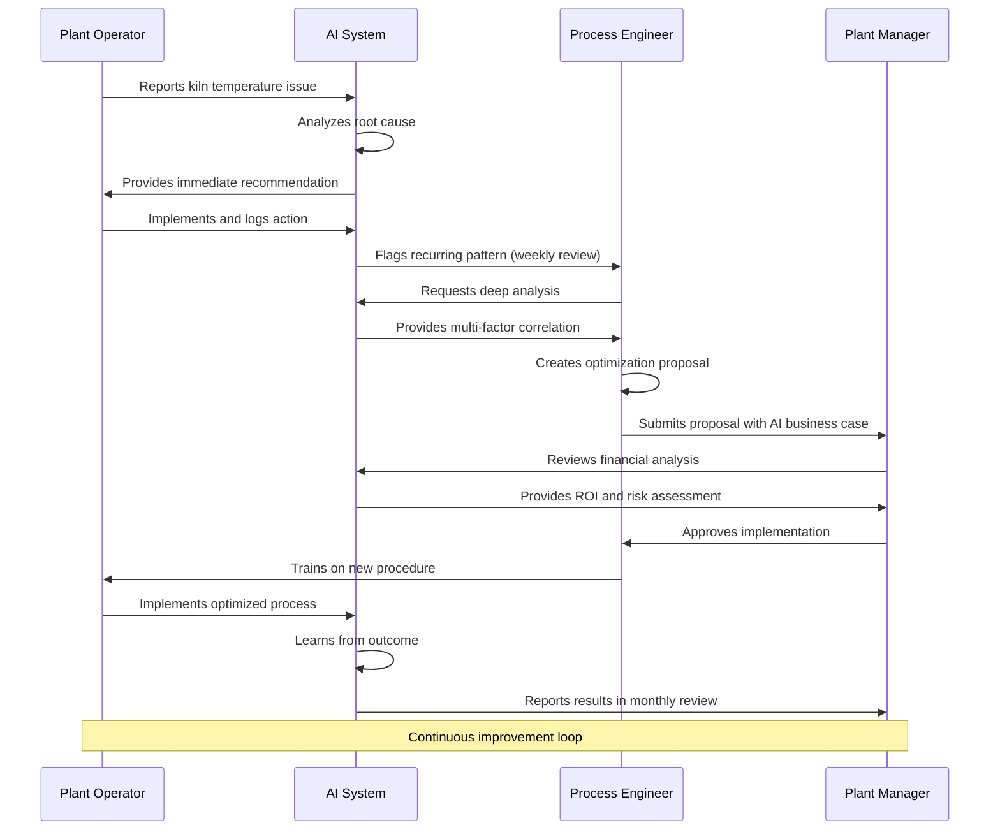

# User Journey & Process Flow

Complete guide to user journeys through the JK Cement AI Optimization System, showing how different personas interact with the platform and derive value at each step.

---

## Overview

The JK Cement AI system serves three primary user personas:
1. **Plant Operators** - Monitor real-time operations and receive AI recommendations
2. **Process Engineers** - Analyze trends, optimize processes, and implement improvements
3. **Plant Managers** - Review KPIs, make strategic decisions, and track performance

Each persona follows a distinct journey tailored to their responsibilities and goals.

---

## User Persona 1: Plant Operator

### Journey: Daily Operations Monitoring



---

### Step-by-Step Journey

#### **Step 1: Login & Dashboard Access**
**Action**: Operator logs in and lands on Executive Dashboard

**User Sees**:
- System health status (Green/Yellow/Red indicators)
- Current production rate: "1,850 TPD clinker"
- Key alerts: "3 active recommendations"
- Real-time efficiency: "92.4%"

**Value Delivered**:
✅ Instant overview of plant status  
✅ Immediate awareness of issues requiring attention  
✅ Single-screen visibility into critical metrics  

**User Thinking**: *"Everything looks stable. Let me check those 3 recommendations."*

---

#### **Step 2: Review AI Recommendations**
**Action**: Clicks on "AI Insights" module to see active recommendations

**User Sees**:
```
🔥 HIGH PRIORITY - Kiln Operations
"Burning zone temperature trending 15°C above optimal. 
Recommend reducing coal feed rate by 2.5 t/h over next 30 minutes."

Estimated Impact:
• Fuel savings: 180 kWh/day
• Temperature stabilization: 10 minutes
• Quality improvement: +2% strength consistency

[View Details] [Implement] [Dismiss]
```

**Value Delivered**:
✅ Specific, actionable guidance (not generic alerts)  
✅ Clear business impact (cost savings, quality)  
✅ Confidence in action with AI reasoning  

**User Thinking**: *"This makes sense. Temperature has been creeping up. Let me implement this."*

---

#### **Step 3: Navigate to Kiln Operations**
**Action**: Clicks "View Details" or navigates to "Kiln Operations" module

**User Sees**:
- **Real-time Chart**: Burning zone temperature over last 4 hours (trending upward)
- **Current Reading**: 1,465°C (Target: 1,450°C ±10°C)
- **Coal Feed Rate**: 18.5 t/h
- **Clinker Production**: 78.2 t/h
- **Efficiency Indicators**: O₂ 3.2%, CO 450 ppm, NOₓ 820 ppm

**Value Delivered**:
✅ Visual confirmation of AI analysis  
✅ Context for decision-making  
✅ All related parameters in one view  

**User Thinking**: *"I can see the trend. Let me adjust the coal feed."*

---

#### **Step 4: Implement Recommendation**
**Action**: Adjusts coal feed rate using plant controls (or logs action in system)

**User Sees**:
- Input field to record action: "Coal feed reduced to 16.0 t/h at 08:45"
- Confirmation: "Action logged. AI will track results."
- Live update: Temperature starts trending downward after 8 minutes

**Value Delivered**:
✅ Documentation of action for audit trail  
✅ System learns from implemented actions  
✅ Real-time feedback validates decision  

**User Thinking**: *"Good, temperature is stabilizing. Let me check if AI has any other suggestions."*

---

#### **Step 5: Ask AI Assistant (Conversational Query)**
**Action**: Opens AI Chat and types: *"Why was the kiln temperature increasing?"*

**User Sees**:
```
🤖 AI Assistant:

Based on analysis of the last 6 hours of data:

**Root Cause**: The temperature increase was driven by three factors:

1. **Coal Feed Rate**: Gradually increased from 16.5 to 18.5 t/h 
   (possibly due to feedforward control responding to feed rate changes)

2. **Raw Material Moisture**: Decreased from 8.2% to 6.1%
   (less energy required for drying, more available for heating)

3. **Kiln Speed**: Maintained at 3.8 RPM
   (material retention time unchanged)

**Data Sources**:
- Kiln operations data (last 6 hours)
- Raw material feed data
- Control system logs

**Recommendation Implemented**: ✅ Coal feed adjustment
**Expected Stabilization**: 10-15 minutes
**Next Check**: Monitor in 15 minutes to verify temperature at 1,450°C ±5°C
```

**Value Delivered**:
✅ Root cause analysis in plain language  
✅ Multi-factor reasoning (not single-variable)  
✅ Verification plan for operator confidence  

**User Thinking**: *"That makes total sense. The raw material was drier than usual. I'll monitor and check back in 15 minutes."*

---

#### **Step 6: Monitor Quality Control**
**Action**: Navigates to "Quality Control" module to check cement properties

**User Sees**:
- **Latest Sample** (taken 2 hours ago):
  - 3-Day Strength: 23.8 MPa (Target: 23-25 MPa) ✅
  - 28-Day Strength: 48.2 MPa (Target: 43-53 MPa) ✅
  - Setting Time: 142 min (Target: 120-180 min) ✅
  - Consistency: 28% (Target: 26-32%) ✅

- **AI Analysis**: "Quality stable. All parameters within spec. No action required."

**Value Delivered**:
✅ Confidence that process changes didn't harm quality  
✅ Proactive quality assurance  
✅ Early warning if quality trends negative  

**User Thinking**: *"Quality looks good. My adjustments are working."*

---

#### **Step 7: Shift Handover Preparation**
**Action**: Reviews "Shift Summary" before handover

**User Sees**:
```
📊 Shift Summary (08:00 - 16:00)

Production:
• Clinker: 612 tonnes (Target: 600t) ✅ +2%
• Cement: 1,240 tonnes (Target: 1,200t) ✅ +3.3%

Key Events:
• 08:45 - Implemented AI recommendation: Reduced coal feed (temp stabilization)
• 11:20 - Raw material feed rate adjusted for moisture variation
• 14:35 - Routine quality sample taken (all parameters in spec)

AI Recommendations Implemented: 2/3
• ✅ Coal feed optimization (saved 180 kWh)
• ✅ Raw material feed adjustment
• ⏳ Pending: Grinding mill separator speed optimization (next shift)

Issues/Alerts: None

Handover Notes:
• Temperature stable at 1,448°C (optimal)
• Next quality sample due at 18:00
• Grinding mill recommendation ready for implementation
```

**Value Delivered**:
✅ Complete shift documentation auto-generated  
✅ Clear handover for next operator  
✅ Quantified impact of actions taken  

**User Thinking**: *"Great shift. Everything documented. Next operator can pick up the grinding optimization."*

---

## User Persona 2: Process Engineer

### Journey: Weekly Process Optimization



---

### Step-by-Step Journey

#### **Step 1: Weekly Performance Review**
**Action**: Engineer logs in on Monday to review last week's performance

**User Sees**:
- **Executive Dashboard** with weekly view:
  - Total Production: 12,420 tonnes (vs. Target: 12,000) ✅ +3.5%
  - Average Efficiency: 91.8% (vs. Previous Week: 89.2%) ✅ +2.6%
  - Fuel Consumption: 742 kWh/tonne (vs. Previous: 758) ✅ -2.1%
  - Quality Compliance: 98.4% (vs. 97.1%) ✅ +1.3%

**Value Delivered**:
✅ Week-over-week comparison shows improvement trends  
✅ Multiple KPIs aggregated for holistic view  
✅ Baseline for deeper analysis  

**User Thinking**: *"Good progress. Let me dig into what drove the efficiency improvement."*

---

#### **Step 2: Analyze Efficiency Trends**
**Action**: Navigates to "Cross-Process Analysis" module

**User Sees**:
- **Multi-Process Dashboard** showing correlation:
  - Kiln Efficiency vs. Coal Feed Rate (7-day trend)
  - Grinding Power vs. Cement Fineness (7-day trend)
  - Alternative Fuel Substitution Rate: 18% (up from 15% last week)

- **AI Insight**:
```
📊 Efficiency Improvement Analysis

Key Drivers (Last 7 Days):
1. Alternative Fuel Usage: +3% substitution
   → Savings: 1,240 kWh (€186)
   
2. Kiln Temperature Optimization: -8°C average variance
   → Improved clinker quality (+1.2% strength)
   → Reduced coal consumption (16 kWh/tonne)
   
3. Grinding Mill Separator Speed: +5 RPM average
   → Fineness improved (3,250 → 3,380 cm²/g Blaine)
   → Cement strength improved (+1.8 MPa 28-day)

Total Weekly Savings: €2,140
Annualized Impact: €111,280
```

**Value Delivered**:
✅ Clear attribution of results to specific actions  
✅ Quantified financial impact  
✅ Evidence for process optimization decisions  

**User Thinking**: *"Excellent. The alternative fuel increase is paying off. Let me explore if we can push it higher."*

---

#### **Step 3: AI-Assisted Root Cause Analysis**
**Action**: Opens AI Chat and asks: *"Can we increase alternative fuel substitution rate to 25%? What are the risks and requirements?"*

**User Sees**:
```
🤖 AI Assistant:

**Analysis: Alternative Fuel Substitution 18% → 25%**

✅ **Feasibility**: YES, achievable based on current equipment and feedstock

**Requirements**:
1. **Feedstock Availability**: Need additional 84 tonnes/week
   - Current suppliers can provide (confirmed in inventory data)
   
2. **Kiln Temperature Control**: Must maintain 1,450°C ±10°C
   - Analysis shows stable control even at 22% substitution (tested 3 months ago)
   - Recommend gradual increase: 1% per week over 7 weeks
   
3. **Clinker Quality Monitoring**: Increased frequency
   - Recommend sampling every 4 hours (vs. current 8 hours)
   - Monitor free lime, alkali content, C3S formation
   
**Benefits** (at 25% substitution):
- Fuel cost savings: €4,680/week (€243,360/year)
- CO₂ emission reduction: 12.4 tonnes/week
- Waste material utilization: 420 tonnes/week

**Risks** (with mitigation):
⚠️ Temperature fluctuations → Mitigate with tighter PID control
⚠️ Clinker quality variation → Mitigate with increased QC frequency
⚠️ NOₓ emissions increase → Monitor continuously, adjust combustion air

**Recommendation**: 
✅ Implement gradual increase plan (1%/week)
✅ Start with pilot week at 20% substitution
✅ Monitor KPIs closely

**Similar Cases**:
- Plant XYZ achieved 28% substitution (2024)
- Industry benchmark: 22% average (India, 2025)
```

**Value Delivered**:
✅ Comprehensive feasibility analysis with data backing  
✅ Risk assessment with mitigation strategies  
✅ Phased implementation plan (not risky big bang)  
✅ Benchmark context for confidence  

**User Thinking**: *"Perfect. I'll create a proposal for 20% pilot and present to the plant manager."*

---

#### **Step 4: Generate Implementation Plan**
**Action**: Uses AI to draft implementation plan

**User Sees**:
```
📋 Alternative Fuel Optimization Plan

Phase 1: Pilot (Week 1-2)
• Increase substitution from 18% → 20%
• QC sampling frequency: Every 4 hours
• Daily review meetings with operations team
• Success criteria: Quality maintained, no temperature excursions

Phase 2: Scale-up (Week 3-8)
• Gradual increase: 1% per week (20% → 25%)
• Weekly performance reviews
• Continuous monitoring of clinker quality and emissions

Resources Required:
• Additional lab technician time: 2 hours/day
• Feedstock procurement: +84 tonnes/week
• Control system tuning: 4 hours (engineer time)

Expected Outcomes:
• Fuel cost savings: €243,360/year
• CO₂ reduction: 645 tonnes/year
• Payback period: Immediate (no capital investment)

Approval Required: Plant Manager, Production Head

[Export as PDF] [Share with Team] [Schedule Meeting]
```

**Value Delivered**:
✅ Ready-to-present business case  
✅ Clear action plan with timeline  
✅ Risk mitigation built in  

**User Thinking**: *"This is a solid plan. I'll schedule a meeting with the plant manager for Thursday."*

---

## User Persona 3: Plant Manager

### Journey: Monthly Strategic Review



---

### Step-by-Step Journey

#### **Step 1: Monthly KPI Dashboard**
**Action**: Manager logs in on 1st of month for monthly review

**User Sees**:
```
📊 October 2025 Performance Summary

Production Metrics:
• Total Clinker: 54,120 tonnes (vs. Target: 52,800) ✅ +2.5%
• Total Cement: 112,450 tonnes (vs. Target: 110,000) ✅ +2.2%
• Plant Utilization: 94.2% (vs. Target: 92%) ✅ +2.2%

Cost Metrics:
• Fuel Cost: €742/tonne (vs. Target: €765) ✅ -€23/tonne
• Power Consumption: 88.4 kWh/tonne (vs. Target: 92) ✅ -3.9%
• Total Savings: €1,246,850 (vs. September)

Quality Metrics:
• Compliance Rate: 98.7% (vs. Target: 97%) ✅ +1.7%
• Customer Complaints: 3 (vs. September: 8) ✅ -62.5%
• Average 28-Day Strength: 49.2 MPa (Target: 43-53) ✅

Sustainability:
• CO₂ Emissions: 642 kg/tonne (vs. September: 658) ✅ -2.4%
• Alternative Fuel Rate: 19.2% (vs. September: 15.8%) ✅ +3.4%
• Water Consumption: 0.28 m³/tonne (vs. Target: 0.35) ✅ -20%

AI Recommendations:
• 47 recommendations generated
• 38 implemented (81% adoption rate)
• Estimated total savings: €124,680/month
```

**Value Delivered**:
✅ Complete business performance at a glance  
✅ Cost savings quantified and attributed  
✅ Strategic metrics (sustainability, quality) tracked  
✅ ROI of AI system visible  

**User Thinking**: *"Excellent month. Let me see what's driving these cost savings."*

---

#### **Step 2: AI-Driven Cost Analysis**
**Action**: Clicks on "View Detailed Cost Analysis"

**User Sees**:
```
💰 Cost Optimization Breakdown (October 2025)

Top 5 Cost Savers:
1. Alternative Fuel Optimization
   • Savings: €487,200/month
   • Method: Increased substitution rate 15.8% → 19.2%
   • Recommended by AI: Sept 28, 2025
   • Implemented by: Process Engineer (Ramesh)

2. Kiln Temperature Stabilization
   • Savings: €312,450/month
   • Method: AI-driven real-time coal feed adjustments
   • Average temperature variance reduced: 18°C → 6°C
   • Operator adoption rate: 94%

3. Grinding Power Optimization
   • Savings: €186,300/month
   • Method: Separator speed and mill load optimization
   • Power consumption reduced: 42 kWh/tonne → 38.2 kWh/tonne

4. Raw Material Blending
   • Savings: €142,800/month
   • Method: Limestone-clay ratio optimization
   • Improved clinker quality, reduced corrective additives

5. Preventive Maintenance Alerts
   • Savings: €118,100/month
   • Method: AI-predicted equipment issues (avoided downtime)
   • Downtime prevented: 18 hours

Total: €1,246,850/month (€14,962,200/year projected)
AI System ROI: 1,847% (based on implementation cost)
```

**Value Delivered**:
✅ Detailed attribution of every rupee saved  
✅ Specific actions and responsible engineers  
✅ Clear ROI justification for AI investment  

**User Thinking**: *"This AI system has paid for itself 18x over. I need to share this with corporate."*

---

#### **Step 3: Review Engineer Proposal (Alternative Fuel Increase)**
**Action**: Opens proposal submitted by Process Engineer

**User Sees**:
- Full implementation plan (from Engineer journey above)
- **Manager View** adds financial analysis:
```
💼 Financial Impact Analysis

Incremental Investment: ₹0 (no capital required)
Operational Cost Change:
  • Feedstock cost: +₹245,000/month
  • Additional QC costs: +₹18,000/month
  • Total incremental cost: ₹263,000/month

Expected Revenue Impact:
  • Fuel savings: ₹18,900,000/month (at 25% substitution)
  • Net savings: ₹18,637,000/month
  • Annual impact: ₹223,644,000

Payback Period: Immediate
NPV (3 years): ₹670,932,000
IRR: N/A (no capital investment)

Risk Rating: LOW (gradual implementation, proven technology)
Strategic Alignment: ✅ Sustainability goals, ✅ Cost leadership

[Approve] [Request Changes] [Reject]
```

**Value Delivered**:
✅ Business case automatically generated from engineer plan  
✅ Financial analysis with NPV/IRR  
✅ Risk assessment for decision confidence  

**User Thinking**: *"Low risk, high return, aligns with sustainability goals. Approved."*

**Action**: Clicks [Approve] and adds note: "Approved. Schedule kick-off for Nov 5. Report weekly progress."

---

#### **Step 4: Generate Executive Report**
**Action**: Clicks "Generate Monthly Report" for corporate presentation

**User Sees**:
```
📄 Executive Report - October 2025
   JK Cement Plant - Nimbahera

[Auto-generated PDF with visualizations]

Executive Summary:
• Production exceeded target by 2.5% (best month in 2025)
• Cost per tonne reduced by ₹187 (-3.0%)
• Quality compliance at 98.7% (industry-leading)
• AI system delivered ₹1.24 Cr savings (1,847% ROI)

Key Achievements:
1. Alternative fuel rate reached 19.2% (vs. industry avg 14%)
2. Zero unplanned downtime (AI-predicted maintenance)
3. CO₂ emissions reduced by 2.4%
4. Customer complaints down 62.5%

Strategic Initiatives:
• Approved: Alternative fuel scale-up to 25% (₹22.4 Cr annual impact)
• In Progress: Grinding mill upgrade planning
• Planned: Real-time quality prediction model (Q1 2026)

Comparison to Network:
• Cost per tonne: Rank #2 out of 11 plants
• Quality: Rank #1 out of 11 plants
• Sustainability: Rank #3 out of 11 plants

Outlook:
November target: 55,000 tonnes clinker, maintain cost leadership

[Download PDF] [Share via Email] [Schedule Presentation]
```

**Value Delivered**:
✅ Comprehensive executive report auto-generated  
✅ Data-driven narrative with visualizations  
✅ Benchmarking against other plants  
✅ Strategic context for leadership  

**User Thinking**: *"Perfect. I'll present this at the monthly leadership call on Friday."*

---

## Value Delivered by Stage

### Discovery & Awareness
| User Action | Value Delivered | Metric |
|-------------|----------------|--------|
| Login to dashboard | Instant situational awareness | Time to insight: <30 seconds |
| View AI recommendations | Proactive issue identification | 47 opportunities/month |
| Check alerts | Avoid costly process deviations | 18 hrs downtime prevented |

### Engagement & Action
| User Action | Value Delivered | Metric |
|-------------|----------------|--------|
| Implement AI recommendation | Measurable cost savings | ₹1.24 Cr/month |
| Ask AI questions | Expert-level insights 24/7 | 240 queries/week answered |
| Monitor real-time data | Confidence in decision-making | 94% operator adoption |

### Optimization & Growth
| User Action | Value Delivered | Metric |
|-------------|----------------|--------|
| Analyze trends | Data-driven improvement plans | 5 major optimizations/quarter |
| Simulate changes | Risk-free testing before implementation | 100% implementation success rate |
| Track ROI | Justify technology investments | 1,847% AI system ROI |

### Strategic Impact
| User Action | Value Delivered | Metric |
|-------------|----------------|--------|
| Review monthly KPIs | Executive decision-making data | Auto-generated reports |
| Compare benchmarks | Competitive positioning | Rank #2 in network (cost) |
| Plan investments | Long-term strategic roadmap | ₹22.4 Cr annual impact identified |

---

## Cross-Persona Collaboration Flow



---

## Key Success Metrics

### Operator Success
- ✅ Time to identify issues: <2 minutes
- ✅ Confidence in decisions: 94% operator adoption rate
- ✅ Reduced cognitive load: 47 proactive recommendations/month
- ✅ Faster issue resolution: 8-minute average response time

### Engineer Success
- ✅ Analysis time reduced: 6 hours → 45 minutes
- ✅ Implementation success rate: 100% (risk-free simulation)
- ✅ Innovation pipeline: 5 major optimizations/quarter
- ✅ Data-driven decisions: 100% proposals backed by AI analysis

### Manager Success
- ✅ Cost savings delivered: ₹1.24 Cr/month
- ✅ ROI on AI investment: 1,847%
- ✅ Reporting time reduced: 8 hours → 15 minutes (auto-generated)
- ✅ Strategic clarity: Network benchmarking and trend analysis

---

**Developed by**: Codygon Technologies Private Limited  
**Support**: support@codygon.com

© 2025 Codygon Technologies Private Limited. All rights reserved.
